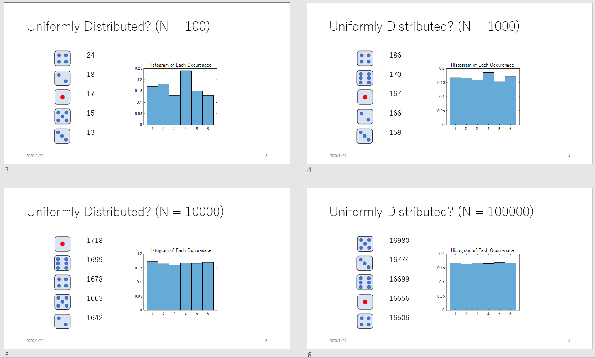
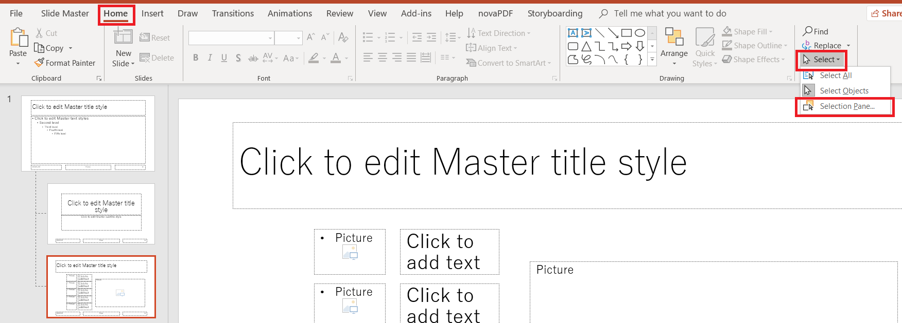
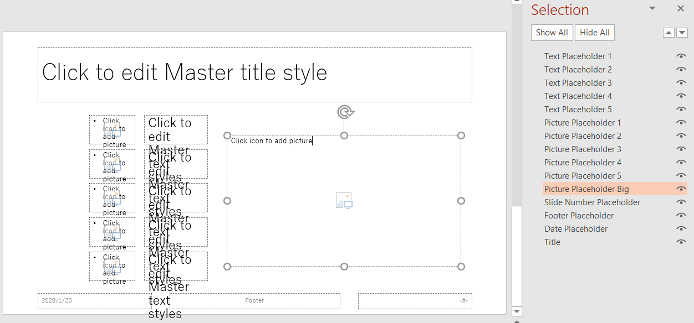

# Automate reporting using MATLAB Report Generator
Copyright (c) 2023 Michio Inoue

シゴトで、定期的にとある集計をパワポに纏めていたんですが、MATLAB&reg; でデータ集めて、グラフをコピペして・・など 30分程かかる作業が地味にめんどくさい。

「まぁ、毎日やることじゃないし・・」と我慢してやっていましたが、2020年は **「退屈なことは MATLAB にやらせよう」**ということで、一念発起して自動化。

その際にはまった点と、PowerPoint&trade; テンプレートの使用例を紹介します。

## 環境

- MATLAB R2023b
- MATLAB Report Generator&trade;

今回は MATLAB Report Generator を使いますが [COM サーバーを使う方法](https://jp.mathworks.com/matlabcentral/answers/99268-powerpoint?s_eid=PSM_29435) に慣れていれば MATLAB だけでもできると思います。

# PowerPoint テンプレートの活用

以前書いた [【MATLAB】PowerPoint スライド作成自動化](https://qiita.com/eigs/items/8c4bf743fc1319762607) では、機械学習の評価結果を纏める作業を自動化しました。ただ、画像の位置などを試行錯誤して特定して、コード内に直書き。

表示位置など変更の必要が無ければ特に困らないとは思いますが、メンテナンス的に残念な例ではありました。すいません。今回は少しだけ背伸びして、PowerPoint のテンプレートを使った例を紹介します。

# サンプルコード

いい題材が思いつかなかったのですが、実際に役に立つかどうかは、皆さんの想像力次第・・ということで、さいころを `N` 回ふった結果をまとめるパワポ作ってみました。

<details><summary>MATLAB コード：さいころレポート</summary><div>

```matlab
%% 事前設定
% ファイル名に今日の日付を使います
reportDate = datetime; 
reportDate.Format = 'yyyy-MM-dd';

% 関連ライブラリの読み込み
import mlreportgen.ppt.*;

% 事前作成したテンプレートからスライド作成
pres = Presentation(fileName,'sampleTemplate.potx');

%% タイトルスライド作成
% テンプレートにある "Title Slide" レイアウトを使用
titleSlide = add(pres,'Title Slide');

% ファイル名やタイトル
fileName     = "sampleReport" + string(reportDate);
titleText    = "サンプルレポート";
subTitleText = "作成日" + string(reportDate);

% プレースホルダの内容を入れ替え
replace(titleSlide,'Title',titleText);
replace(titleSlide,'Subtitle',subTitleText);

%% ここからレポートページ
% さいころを N 回振って、出る目の回数を集計します。
names = ["one","two","three","four","five","six"];

for ii=1:5 % 10回 から 10万回まで
    N = 10^ii;
    
    % 1 から 6 までの整数を生成
    diceResults = randi(6,[N,1]);
    % それぞれの出目の回数を集計
    counts = histcounts(diceResults);
    [countsSorted,idx] = sort(counts,'descend');
    
    % ヒストグラムプロット作成
    hFigure = figure(1);
    histogram(diceResults,'Normalization','probability');
    title('Histogram of Each Occurenace');
    ha = gca;
    ha.FontSize = 20;
    
    % 画像として保存して後に、パワポにコピー
    imgPath = saveFigureToFile(hFigure);
    pictureObj = Picture(imgPath);
    
    % スライドタイトル
    slideTitle = "Uniformly Distributed? (N = " + string(N) + ")";
    
    % 事前に準備しておいた Custom レイアウトからページ作成
    slide = add(pres, 'Custom');
    replace(slide,'Title',slideTitle); % タイトル
    replace(slide,'Picture Placeholder Big', pictureObj); % 真ん中はヒストグラムを配置
    
    % 出た回数順にトップ５：出た回数と画像を配置
    topfive = names(idx);
    for jj=1:5
        % 画像は事前に用意したものを使用
        imagePath = "./images/" + topfive(jj) + ".png";
        if ~exist(imagePath,'file') % 念のため画像がない場合
            imagePath = "./images/a.png";
        end
        pictureObj = Picture(char(imagePath));
        replace(slide,"Picture Placeholder " + jj, pictureObj);
        replace(slide,"Text Placeholder " + jj, string(countsSorted(ii)));
    end
    
    % hFigure を閉じる
    if( isvalid(hFigure) )
        close(hFigure);
    end
end

%% 以上のページをもとにパワポ作成
% msgbox でダイアログ出してみる
hMsg = msgbox('Generating PowerPoint report...');

% pres を閉じておきます。
close(pres);
if(ispc) % できたパワポを開く
    winopen(pres.OutputPath);
end

% ダイアログ閉じる
if( isvalid(hMsg) )
    close(hMsg);
end

```
</div></details>




はい、想像通りの結果ですね。さいころの画像は事前に作っておく必要がありますが、こんな感じのレポートがクリック 1 つでできちゃいます。

使いどころありそうですか？


# はまったポイント

MATLAB というより PowerPoint 側の話なんですが、テンプレートの「プレースホルダー名」と「コンテンツ オブジェクト名」を表示する方法が分かりませんでした・・ orz。

例えば

```matlab

%% タイトルスライド作成
% テンプレートにある "Title Slide" レイアウトを使用
titleSlide = add(pres,'Title Slide');

% ファイル名やタイトル
fileName     = "sampleReport" + string(reportDate);
titleText    = "サンプルレポート";
subTitleText = "作成日" + string(reportDate);

% プレースホルダーの内容を入れ替え
replace(titleSlide,'Title',titleText);
replace(titleSlide,'Subtitle',subTitleText);
```

という形で、'Title' や 'Subtitle' などの名前を MATLAB 側から参照しながらスライドを構成していくんですが、その名前がどこで確認できるのか・・


ここにありました。[Home] -> [Select] -> [Selection Pane] をクリックすると



こんな感じ。プレースホルダーの名前をクリックすれば任意の名前に変更可能です。

公式ページとしては [PowerPoint テンプレート要素へのアクセス](https://jp.mathworks.com/help/rptgen/ug/access-powerpoint-template-elements.html?s_eid=PSM_29435)の「プレースホルダー名とコンテンツ オブジェクト名の表示と変更」にも詳しい解説があります。


# まとめ

さいころを `N` 回振って・・なんてレポート書く人いないと思いますが、サンプルとしてお役に立てばうれしいです。

私の場合は、データベースからデータを引っ張ってきて（[Database Toolbox&trade;](https://jp.mathworks.com/products/database.html?s_eid=PSM_29435)) 、定期的に変化するランキングみたいなものをまとめるのに、今回紹介したテンプレートを使っています。
